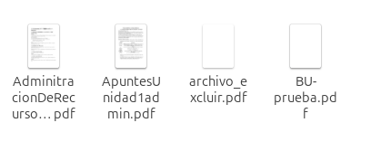
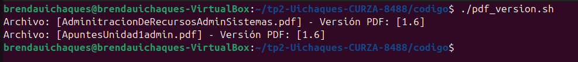
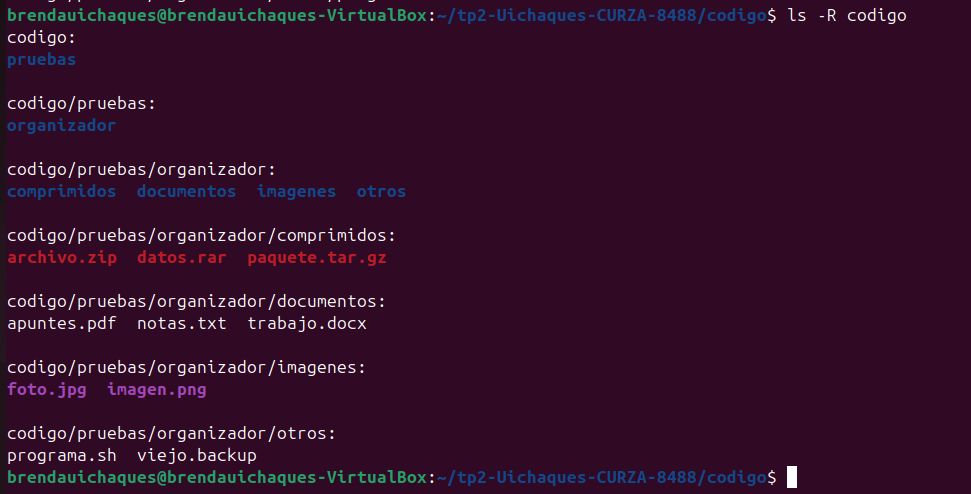
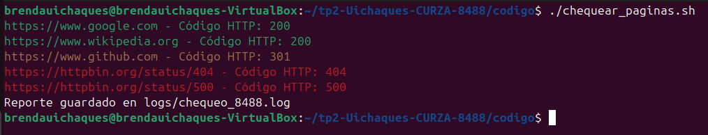

# Trabajo Práctico 2 - Capturas de los Scripts Avanzados en Bash

## Tarea 1: Buscador de Versiones en PDF

## Tarea 2: Renombrador y Organizador Automático

## Tarea 3: Monitoreo Interactivo de Recursos

## Tarea 4: Verificador de Sitios Web

## Tarea 5: Respaldador con Prevención de Ejecución Simultánea

